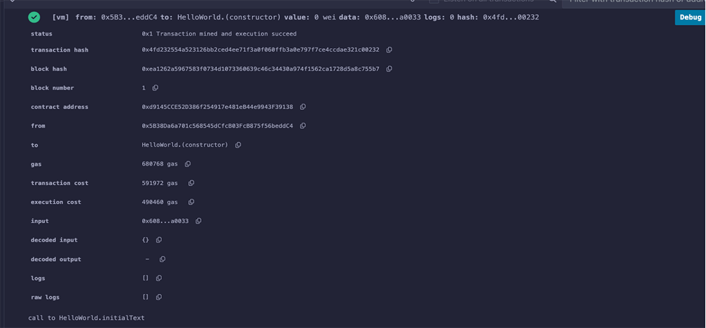

# Week 1 - Group Project Submission

## Assignment Tasks - Week 1 - Group No. 5

**Date of Submission:** 9-Aug-2024

### Project Overview
This is a group activity for at least 3 students. The objective is to interact with the `HelloWorld.sol` smart contract to change message strings and change owners. The steps involve writing a report with each function execution and including the transaction hash if successful or the revert reason if failed.

### Steps

1. **Compiled the smart contract and deployed it**
2. **Constructor called on HelloWorld.sol deployment:**
   - The constructor initializes the state variable `text` to “Hello World” and assigns the `owner` variable to the deployer.
   
3. **Calling `HelloWorld.initialText()`**
4. **Calling `HelloWorld.setText()` function:**
   - Checking if the text was changed using the `helloWorld()`.
5. **Calling `transferOwnership()`**
   - Contract ownership transferred to a new address. Verified by checking the `owner` public variable.
6. **Adding `onlyOwner` modifier to `setText()` function**
7. **Add `onlyOwner` modifier to `setText()` function and test behavior:**
   - Called `setText()` function as the owner/deployer and changed text - **WORKED**
   - Checked if the text changed using `helloWorld()` function - **WORKED**
   - Changed ownership using `transferOwnership()` function - **WORKED**
   - Checked if the ownership changed using `owner` state variable - **WORKED**
   - Called `setText()` function and tried to change the text - **ERROR!** (Ownership was transferred to a different address)

### Smart Contract Code (HelloWorld.sol)

```solidity
// SPDX-License-Identifier: GPL-3.0

pragma solidity >=0.8.2 <0.9.0;

/// @title EVM Bootcamp August 2024 Group-5 Week-1 Group Project

contract HelloWorld {

    /// @dev text is a private state variable to store any text
    string private text;

    /// @dev owner represents the owner of this Smart Contract
    address public owner;

    /// @dev onlyOwner modifier checks if the caller of the function
    /// is the owner/deployer of the Smart Contract
    /// @dev if not, then it raises an error with text "Caller is not the owner"
    modifier onlyOwner() {
        require(msg.sender == owner, "Caller is not the owner");
        _;
    }

    /// @dev the address of the creator/deployer of this Smart Contract
    /// @dev also initializes the text variable
    constructor() {
        text = initialText();
        owner = msg.sender;
    }

    /// @dev initialText() returns a string, "Hello World"
    function initialText() public pure virtual returns (string memory) {
        return "Hello World";
    }

    /// @dev helloWorld() function returns the state variable, 'text'
    function helloWorld() public view returns (string memory) {
        return text;
    }

    /// @dev only the deployer of the contract can change the state variable, 'text'
    /// @dev setText() function sets the state variable, 'text'
    function setText(string calldata newText) public {
        require(msg.sender == owner);
        text = newText;
    }

    /// @dev this function changes the owner of the Smart Contract
    function transferOwnership(address newOwner) public onlyOwner {
        owner = newOwner;
    }
}
```

### Report Summary

- **Compiled and deployed** the smart contract.
- **Constructor** was called, initializing `text` to "Hello World" and setting `owner` to the deployer.
- Successfully **called** `initialText()` and `setText()` functions.
- **Verified** text changes and ownership transfers.
- **Tested `onlyOwner` modifier** behavior, confirming that only the owner can change the `text`.
